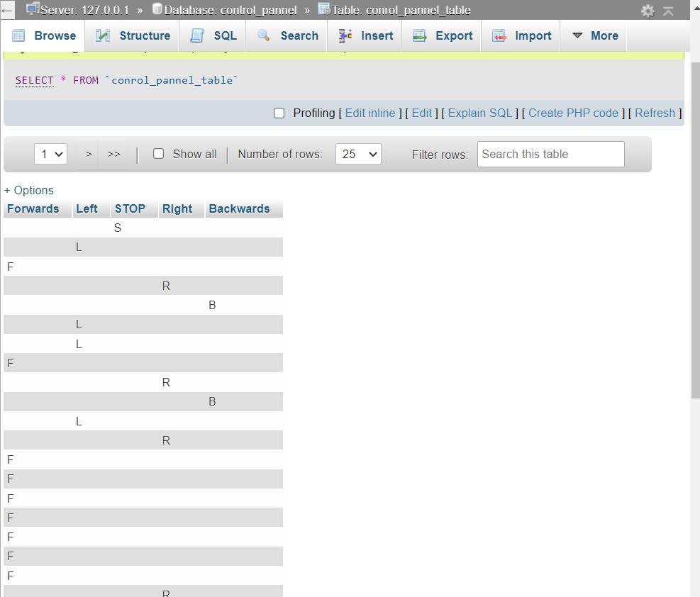
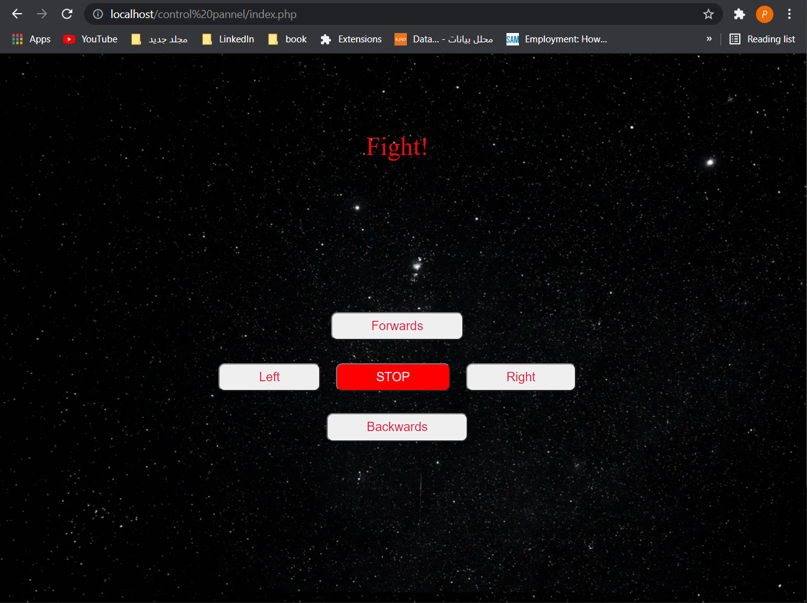

# لوحة تحكم بالروبوت
هذا المشروع أحد المهام المطلوبة في التدريب على رأس العمل من شركة الاساليب الذكية مسار انترنت الاشياء وهو عبارة عن  واجهه تحكم بالروبوت باستخدام
HTML ,CSS,JS 
لتصميم الواجهات واستخدام 
PHP ,Mysql 
للباك اند 

## محتويات المشروع 
*   قاعدة البيانات
*   صفحة للتحكم بالروبوت
*   صفحة تستخدم للربط مع الهارد ويير 
 

## قاعدة البايانات 

تحتوي قاعدة البيانات على خمسة اعمدة اربع منها للاتجاهات امام خلف يمين يسار والعمود الاخير لتخزين قيمة زر التوقف 

## صفحة للتحكم بالروبوت
ملف php للتحكم بالاتجاهات وللتوقف 

## الربط مع الهارد وير 

للربط مع الهارد تأتي فائدة response page وهي صفحة php تقول بعرض اخر قيمة تم اداخلها لقاعدة البانات 

 

